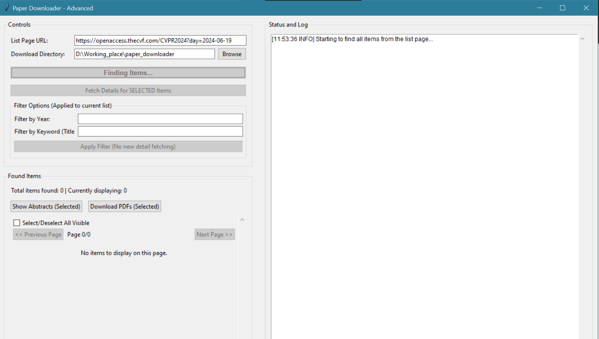
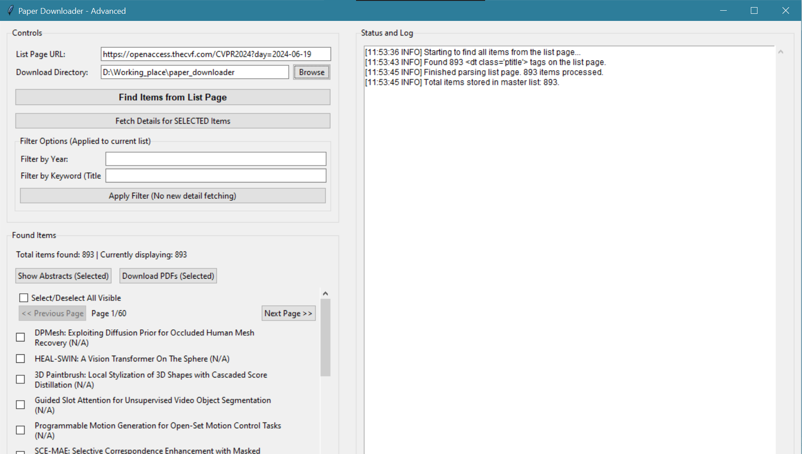
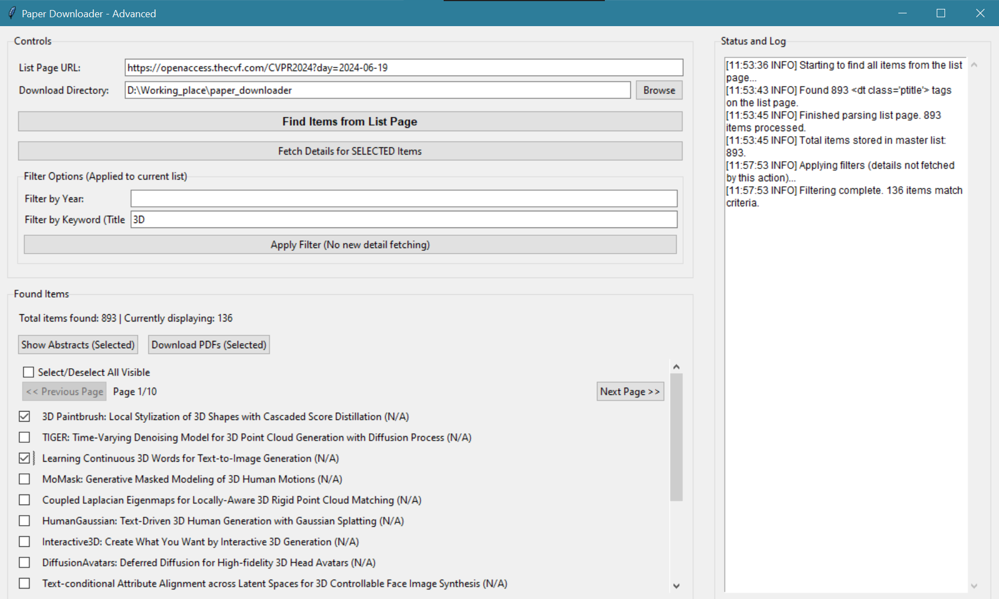
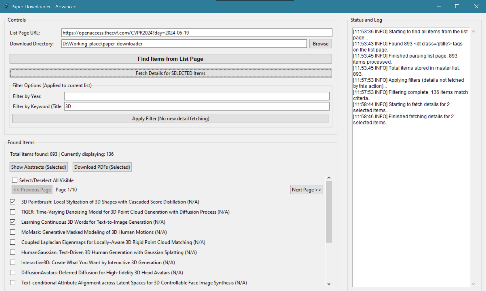
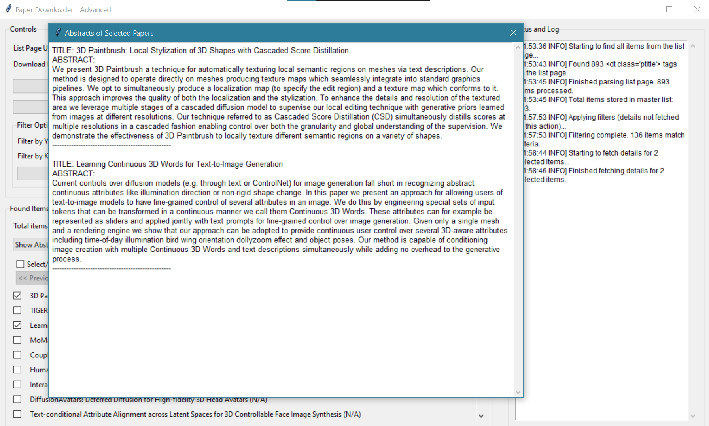

# 📄 Python Paper Downloader GUI 🐍

Welcome to the Paper Downloader! This desktop application is designed to help you easily find, filter, and download academic papers from open-access websites, especially useful for sites like The CVF's Open Access.

✨ **Intuitive interface, clear step-by-step workflow!** ✨

## 🌟 Key Features

* **User-Friendly GUI:** Built with Tkinter and ttk for an easy-to-use experience.
* **Step-by-Step Workflow:**
    1.  🔍 **Initial Item Search:** Fetches a basic list of papers from the main URL.
    2.  👆 **Manual Selection:** You choose the items you're interested in.
    3.  📑 **Fetch Detailed Info:** Downloads direct PDF links and abstracts for *only your selected items*.
    4.  🔬 **Smart Filtering:** Filter the list by publication year and keywords.
    5.  📖 **Convenient Abstract Viewer:** Read abstracts of selected papers directly within the app.
    6.  💾 **Selective Downloading:** Download only the papers you actually need and that have a PDF link.
* **Smart Pagination:** Easily browse through thousands of results.
* **Smooth Multithreading:** Network tasks run in the background, keeping the UI responsive.
* **Activity Logging:** Keep track of all actions and errors (if any).

## 📸 Visual User Guide (Main Steps)

Here's a typical workflow with the application:

---

### Step 1: Launch & Initial Configuration

1.  **Run the application.**
2.  **Paste List Page URL:** Enter the URL of the website containing the list of papers (e.g., `https://openaccess.thecvf.com/CVPR2024?day=all`).
3.  **Select Download Directory:** Specify where you want to save the downloaded PDF files.

    

---

### Step 2: Initial Item Search

* Click the **"1. Find Items from List Page"** button.
* The application will load basic information (title, detail page link, year) from the URL you provided.
* Items will appear in the results list. Checkboxes next to each item will be enabled, allowing you to select them.

    

---

### Step 2.5: Apply Filters (Optional)

* Enter a **Year** and/or **Keywords** in the respective fields.
* Click the **"3. Apply Filter (No new detail fetching)"** button. *(Note: The button number in the UI might be different, this refers to the conceptual step in this guide)*
* The list will be filtered to show only matching items. This step does *not* fetch new detailed information.

---

### Step 3: Select Items of Interest

* Browse through the list (either the full list or the filtered list) and **tick the checkboxes** of the papers you are interested in.

    

---

### Step 4: Fetch Detailed Information (PDF, Abstract)

* After selecting items, click the **"2. Fetch Details for SELECTED Items"** button. *(Note: The button number in the UI might be different, this refers to the conceptual step in this guide)*
* The application will visit the detail page of *each item you selected* to retrieve the direct PDF link and abstract content.
* The list will update. Tooltips will show more detailed information.

    

---

### Step 5: View Abstracts & Download PDFs

* **View Abstracts:** Select items (that have had details fetched and have an abstract), then click the **"Show Abstracts (Selected)"** button. A new window will appear displaying the abstracts.
* **Download PDFs:** Select items (that have had details fetched and have a PDF link), then click the **"Download PDFs (Selected)"** button (either above the list or the large one at the bottom).

    

---

## ⚙️ System Requirements

* Python 3.7+
* The following Python libraries:
    * `requests` (for making HTTP requests)
    * `beautifulsoup4` (for parsing HTML)

## 🚀 Installation

1.  **Get the source code:**
    * If it's a Git project: `git clone <repository_url>` and `cd <repository_directory>`
    * Or download the `.py` script file directly.

2.  **Create a virtual environment (recommended):**
    ```bash
    python -m venv venv
    ```
    * On Windows: `venv\Scripts\activate`
    * On macOS/Linux: `source venv/bin/activate`

3.  **Install the required libraries:**
    Create a `requirements.txt` file with the following content:
    ```
    requests
    beautifulsoup4
    ```
    Then install using pip:
    ```bash
    pip install -r requirements.txt
    ```
    Or install them directly:
    ```bash
    pip install requests beautifulsoup4
    ```

## ▶️ Running the Application

```bash
python scripts.py 

📜 Web Scraping EthicsThis tool is intended for personal, convenient access to publicly available information.Always respect the terms of service and robots.txt file of the websites you access.Avoid sending too many requests in a short period to prevent overloading the server. The script includes small delays, but responsible usage is crucial.The developer of this script is not responsible for misuse.📄 LicenseThis project is open-source. You are free to use, modify, and distribute it. Please consider providing attribution if you build upon this project. 